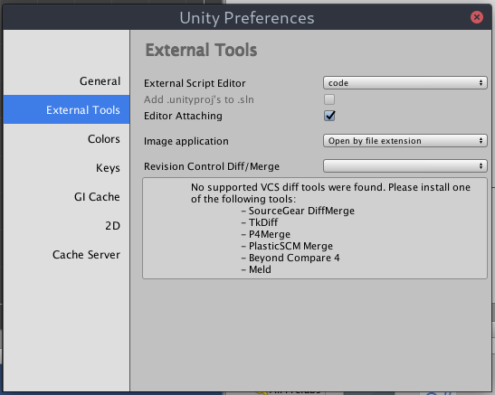
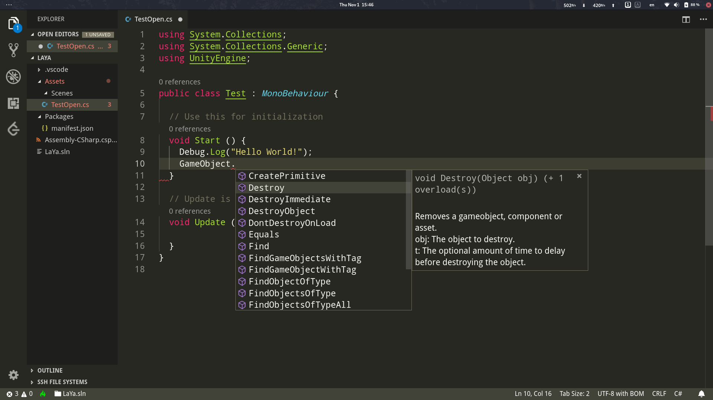

## Installation

```bash
$ sudo pacman -S mono dotnet-sdk
$ yaourt -S unityhub msbuild-stable
```

## Setup: VScode

Install Vscode [C# extension](https://marketplace.visualstudio.com/items?itemName=ms-vscode.csharp)

```bash
# Launch VS Code Quick Open (Ctrl+P), paste the following command, and press enter.
ext install ms-vscode.csharp
```

## Setup Unity

Setup external script editor



## Let's Coding!

everything fine


